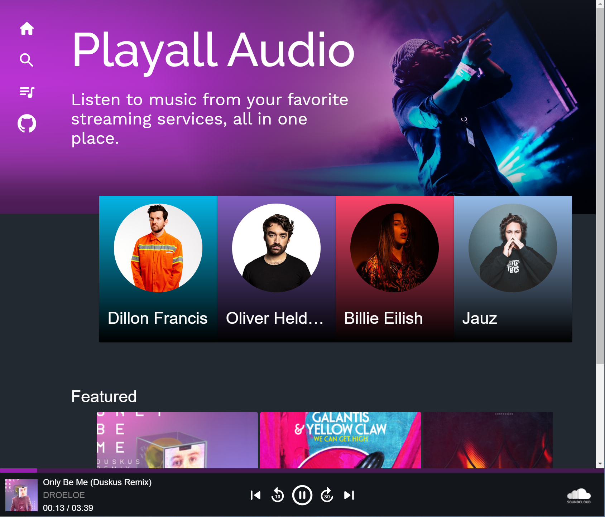

# Playall Audio :musical_note:
Website to search for, queue up, and listen to music from multiple streaming services.

#### Supported music sources:
- :white_check_mark: **SoundCloud** (Limited to artists who allow 3rd-party API usage)
- :white_check_mark: **Spotify** (Spotify Premium required)

## Demo
[](https://app.netlify.com/sites/playallaudio/deploys)

The live site can be found at: https://playall.audio/



## Technologies
- React
- Material UI
- TypeScript
- Lambda
- Netlify (for deployment)

## Local Development

### Environment variables
In the root directory, create a `.env` with:
```
REACT_APP_SOUNDCLOUD_CLIENT_ID=<soundcloud client id>
REACT_APP_SPOTIFY_REDIRECT=http://localhost:3000/.netlify/functions/spotifyCallback
REACT_APP_SPOTIFY_CLIENT_ID=<spotify client id>
SPOTIFY_CLIENT_SECRET=<spotify client secret>
APP_URL=http://localhost:3000
```

### Available Commands
#### `npm run start`
Run both the app and the lambda functions locally on port `3000`.
#### `npm run start:app`
Run the react client app in `/src` locally on port `3000`.
#### `npm run start:lambda`
Run the lambda functions defined at `/lambda/functions` locally on port `9000`.
#### `npm run build`
Builds both the app and the lambda functions.
#### `npm run build:app`
Builds the react client app to `/build`.
#### `npm run build:lambda`
Builds the lambda functions to `/lambda/build`.
#### `npm test`
Runs unit tests in the react app.
